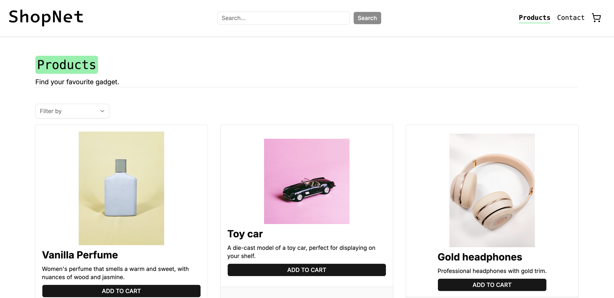

# ShopNet (JSF Online Shop Assignment)



**Live Site:** [shopnet.telecasternilsen.com](https://shopnet.telecasternilsen.com)

**Author:** Tele Caster Nilsen<br/>
**Website:** [telecasternilsen.com](https://telecasternilsen.com)<br/>

---

**Table of Contents**

- [Technologies](#technologies)
- [Decisions](#decisions-explained)
- [Get Started](#get-started)
- [Resources](#resources)
- [AI Usage](#ai-usage)

---

## Technologies

- React
- Typescript
- Tanstack router
- Tanstack Query
- Zod
- Tailwind (styles)
  - Lucide Icons
  - shadcn component and styling principles

---

### Decisions Explained

**Why Tanstack Router?**<br/>
Simply because I like the idea of file-based routing and their type-safe approach.

**Why Tanstack Query?**<br/>
Architectural consistency by utilising Tanstack's ecosystem, it goes well with their Router. I appreciate their take on the developer experience when working with caching and server state updates.

**Why Redux Toolkit (RTK)?**<br/>
Currently, this applications first iteration holds a rather simple state management. But it's the kind of application that quickly scales into a complex ecosystem with payment and shipping methods, address data, promotions, inventory checks, and order history. Therefore, I chose to implement a system with RTK, so the app's scalability aligns with a growing app and developer team. Taking advantage of benefits such as:

- Developer experience (team work-alignment)
- Explicit business rules
- Feature-slice patterns

---

## Get Started

Clone and open the project

```bash
git clone https://github.com/NoroffFEU/jsfw-2025-v1-teles_jsf_ca_2026.git
cd jsfw-2025-v1-teles_jsf_ca_2026
code . # or IDE of choice
```

Install dependencies

```bash
npm install
```

Run the project

```bash
npm run dev
```

**Available scripts**

```bash
npm run dev # runs the project in development mode
npm run build # builds the project for production
npm run lint # formats all relevant files
```

### Deployment

This application is deployed with Netlify, as a sub-domain to: `telecasternilsen.com`.<br/>
**Live Site:** [shopnet.telecasternilsen.com](https://shopnet.telecasternilsen.com)

## Resources

- [Noroff API Documentation](https://docs.noroff.dev/docs/v2/basic/online-shop)
- [Tanstack Router](https://tanstack.com/router/latest/docs/quick-start)
- [File-based-routing - the why](https://tanstack.com/router/latest/docs/decisions-on-dx)
- [File-based-routing - the how](https://tanstack.com/router/latest/docs/routing/file-based-routing)
- [Tanstack Router - LinkOptions](https://tanstack.com/router/latest/docs/guide/link-options)
- [Open Dialog with React useState](https://stackoverflow.com/questions/78368196/triggering-a-radix-dialog-or-shadcn-dialog-via-a-react-component-not-a-button)
- [Aria live region attributes](https://developer.mozilla.org/en-US/docs/Web/Accessibility/ARIA/Guides/Live_regions)
- [Radio group pattern](https://www.w3.org/WAI/ARIA/apg/patterns/radio/)
- [Tanstack Router meta](https://tanstack.com/router/latest/docs/guide/document-head-management#single-page-applications)
- [Tanstack Query options](https://tanstack.com/query/latest/docs/framework/react/guides/query-options)
- [Tanstack Router search params](https://tanstack.com/router/latest/docs/guide/search-params)
- [react-hook-form](https://react-hook-form.com/docs/)
- [useWatch - react-hook-form](https://medium.com/@vmaineng/how-i-implemented-zod-and-react-hook-form-for-register-component-and-lessons-i-ve-learned-3a51c4dd3894)

---

## AI Usage

Go to [AI_LOG.md](AI_LOG.md)
